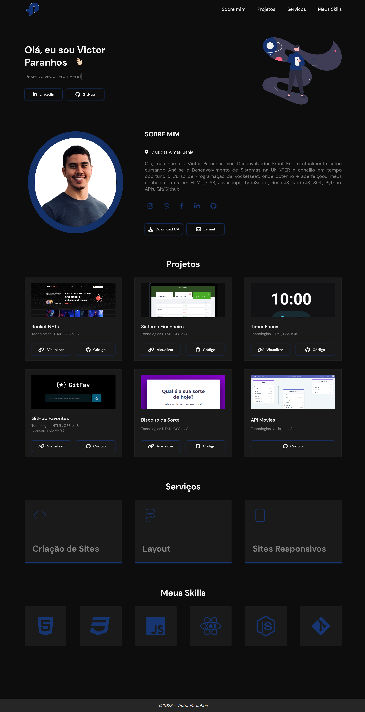

## 🚀 Tecnologias

Esse projeto foi desenvolvido com as seguintes tecnologias:

- HTML
- CSS
- JavaScript

## 💻 Projeto PortFolio

- Totalmente Responsivo (Versao Desktop e Mobile)
- Animacões usando a biblioteca do ScrollReveal
- Icones Fontawesome
- Fontes Google

## 🔖 Layout

<h1 align="center">
    
</h1>

Victor Paranhos 👨🏻‍💻
